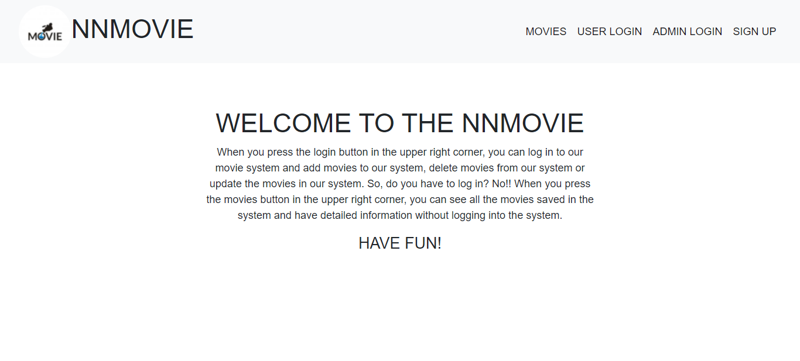
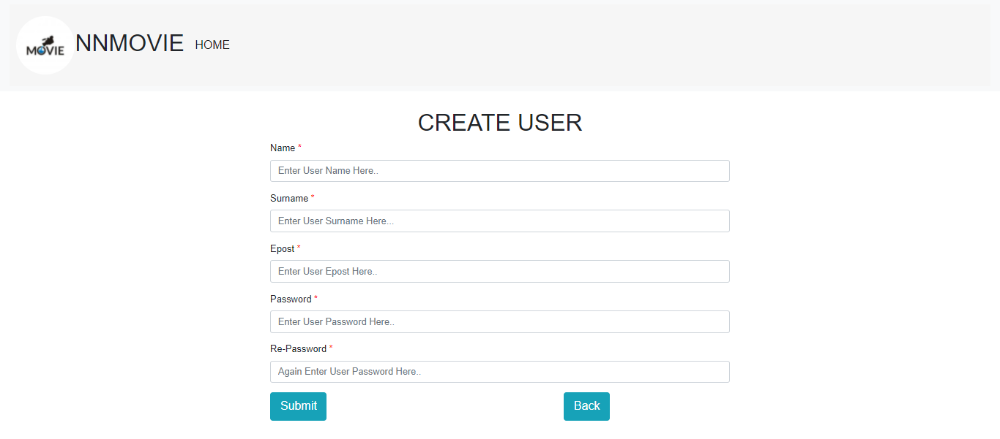
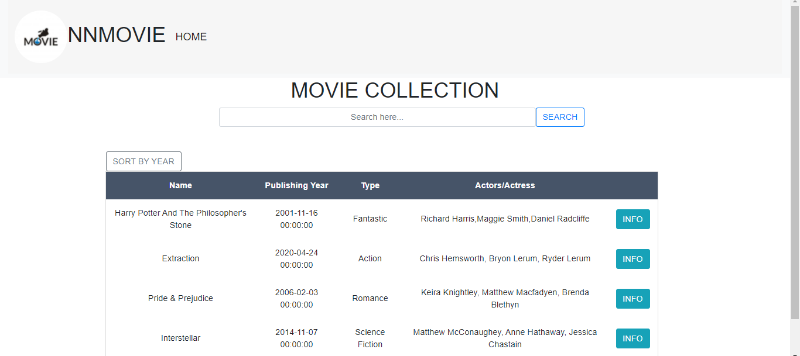
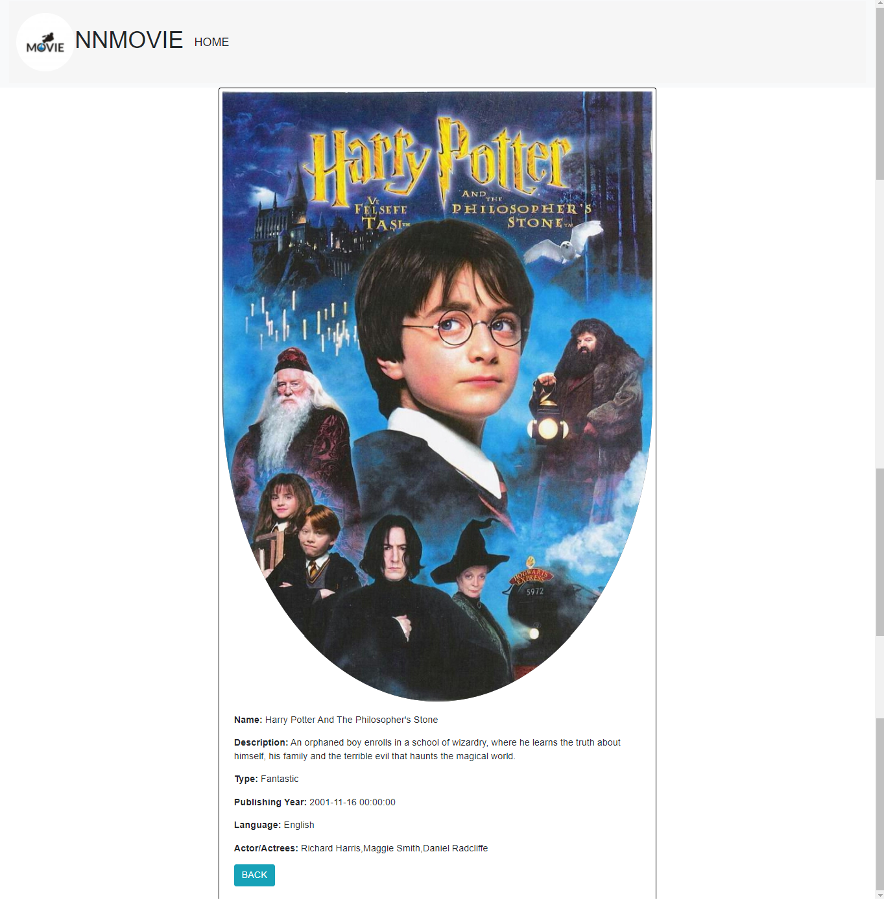
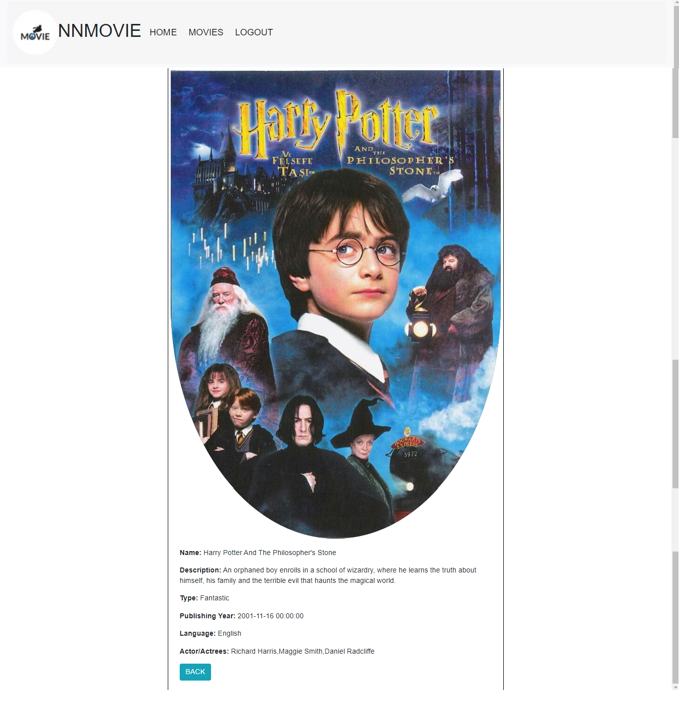
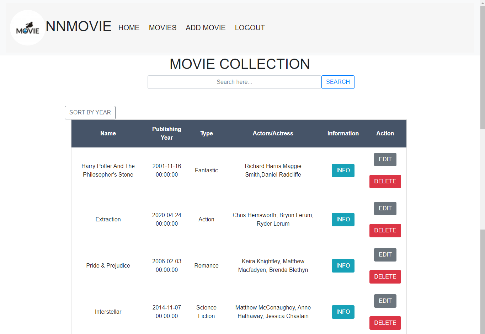
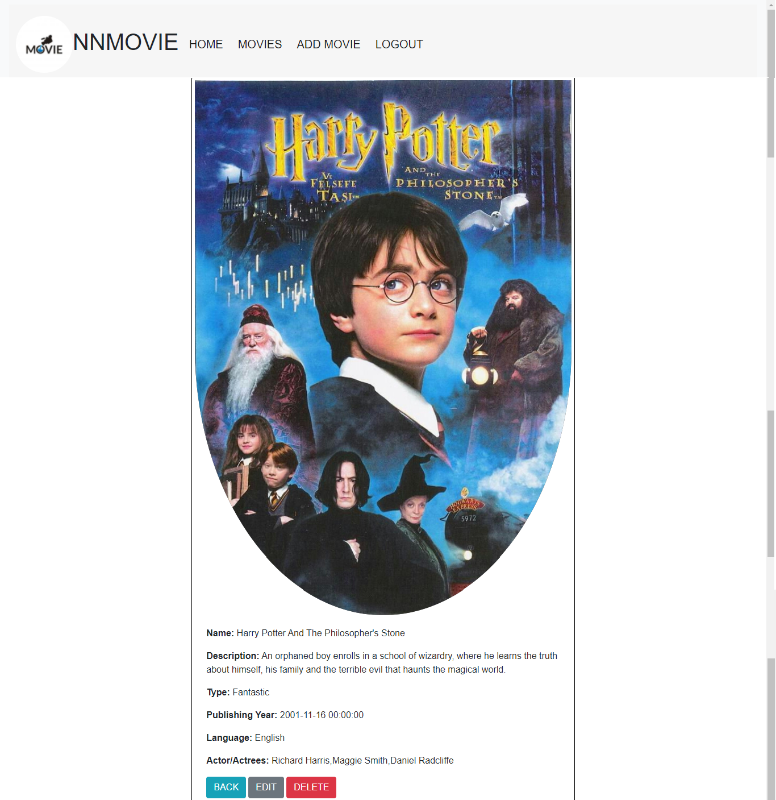
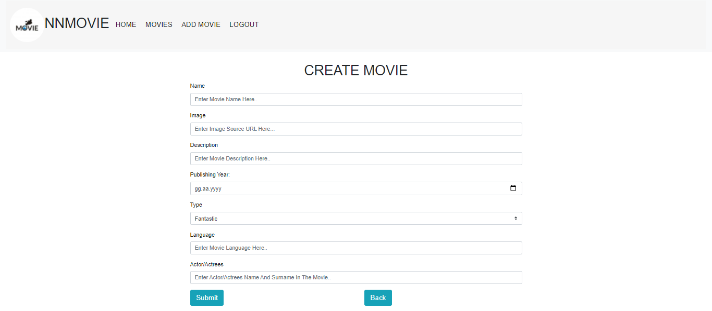

## NNMOVIE

 NNMOVIE is a movie archive collection. When you press the login button in the upper right corner, you can log in to our movie system and add movies to our system, delete movies from our system or update the movies in our system. So, do you have to log in? No!! When you press the movies button in the upper right corner, you can see all the movies saved in the system and have detailed information without logging into the system.
 
!!EXPLANATION!!

 Normally I needed to pull data via API using thymeleaf. But since I am new to the JAVA Web part, I could not pull the data using thymeleaf. In order to avoid any deficiencies in the project, I displayed the data directly from the database via the connection string. And the n-n module is not working for now. Missing parts will be completed soon. Finally, on some pages, the items in the header section are close to the logo. Normally, these items are positioned on the right, but this is how it perceives the css part a little late.
 
## Three Module
 User Module, Guest Module, Admin Module
 
#Technology Used

 Spring boot for Autoconfiguration Spring MVC For Web application development JSP used for User Interface JPA,Thymeleaf, Hibernate, Bootstrap used Database Used MySQL
 
## IMAGES

 HOMEPAGE
 

CREATE USER

GUEST HOMEPAGE

GUEST INFO PAGE

USER AND ADMIN LOGIN

USER HOMEPAGE

USER INFO PAGE

ADMIN HOMEPAGE

ADMIN INFO PAGE

ADMIN CREATE MOVIE PAGE

ADMIN EDIT MOVIE PAGE

## MySQL Insert

After we have created your tables with MySQL, you can manually add users, administrators and movies, or you can add the information in the MySQL_insert file to your system with a query.

## PROJECT RUN COMMAND

download zip forder

unzip and open folder with netbeans/eclipse ide

create a database name moviecollection in mySQL

clean and build folder

finaly run maven Goals
